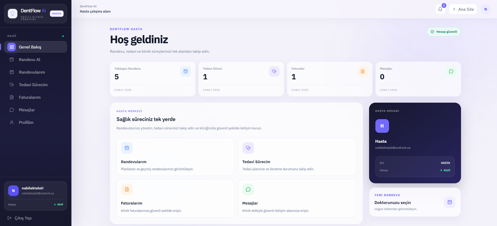
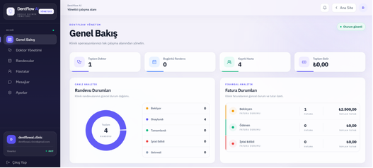
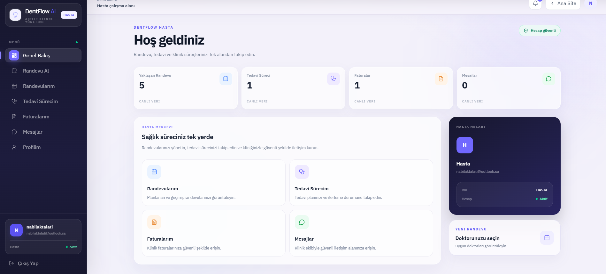
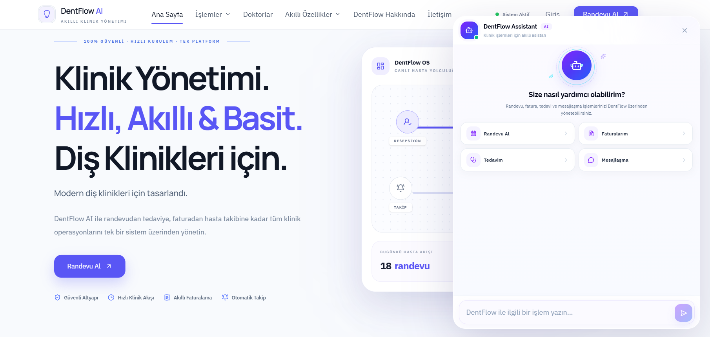

# DentFlow AI

**AI-Powered Dental Clinic Management Platform**

DentFlow AI is a full-stack dental clinic management system designed to manage appointments, treatments, invoices, communication, analytics, and AI-assisted patient workflows from a single platform.

🌐 **Live Demo:** https://dentflow-ai.onrender.com

---

## Features

### Patient
- Secure registration and email OTP verification
- Appointment booking with real-time doctor availability
- Appointment tracking and cancellation
- Treatment history and treatment reports
- Invoice management and PDF downloads
- Internal messaging and notifications
- AI-powered clinic assistant

### Doctor
- Role-based secure dashboard
- Appointment overview
- Patient treatment management
- Invoice and treatment information
- Internal messaging

### Admin
- Doctor management
- Patient and appointment management
- Real-time clinic analytics
- Appointment status analytics
- Financial and invoice analytics
- Administrative dashboard

### AI Assistant
DentFlow AI includes an AI assistant capable of helping patients with:

- Appointment information
- Appointment availability
- Appointment creation and cancellation
- Invoice information
- Treatment information
- Messaging
- General clinic assistance

Sensitive actions require explicit user confirmation before execution.

---

## Security

- Access & Refresh Token authentication
- HttpOnly cookies
- Session-based authentication
- Role-Based Access Control (RBAC)
- Email OTP verification
- Password hashing
- Zod request validation
- Protected frontend routes
- Secure API authorization
- AI action confirmation
- Production Content Security Policy

---

## Tech Stack

### Frontend
- React
- Vite
- Tailwind CSS
- React Router
- Motion
- Lucide React
- Recharts
- React PDF

### Backend
- Node.js
- Express.js
- MongoDB Atlas
- Mongoose
- Zod
- JWT
- HttpOnly Cookies

### Services
- Brevo Transactional Email API
- AI API integration
- Cloudinary
- Render

---

## User Roles

DentFlow AI uses three main roles:

- `PATIENT`
- `DOCTOR`
- `ADMIN`

Each role has its own protected dashboard and permissions.

---

## System Workflow

```text
Patient Registration
        ↓
Email OTP Verification
        ↓
Secure Login
        ↓
Patient Dashboard
        ↓
Appointment
        ↓
Visit / Treatment
        ↓
Invoice
        ↓
Follow-up
```

---

## Production

DentFlow AI is deployed on Render and connected to MongoDB Atlas.

**Production URL**

https://dentflow-ai.onrender.com

Health endpoint:

```text
/api/health
```

---

## Project Structure

```text
dentflow-ai/
├── backend/
│   ├── config/
│   ├── constants/
│   ├── controllers/
│   ├── middleware/
│   ├── models/
│   ├── routes/
│   ├── services/
│   └── validators/
│
├── frontend/
│   └── src/
│       ├── app/
│       ├── components/
│       └── features/
│           ├── auth/
│           ├── dashboard/
│           ├── landing/
│           └── ai-assistant/
│
└── README.md
```

---

## Development

### Backend

```bash
cd backend
npm install
npm run dev
```

### Frontend

```bash
cd frontend
npm install
npm run dev
```

Environment variables must be configured locally before running the complete application.

> API keys, database credentials, passwords, and other secrets are never stored in the repository.

---

## Project Status

✅ Full-stack architecture  
✅ Authentication & RBAC  
✅ Patient / Doctor / Admin dashboards  
✅ Appointment management  
✅ Treatment management  
✅ Invoice & PDF workflow  
✅ Messaging & notifications  
✅ AI Assistant  
✅ Admin analytics  
✅ Production deployment  
✅ Responsive interface  

---
## Screenshots

### Home Page


### Admin Dashboard


### Patient Dashboard


### AI Assistant



## Author

**Nabil Aktalati**

Computer Engineering Student  
İskenderun Technical University